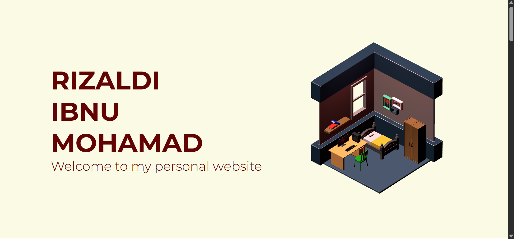
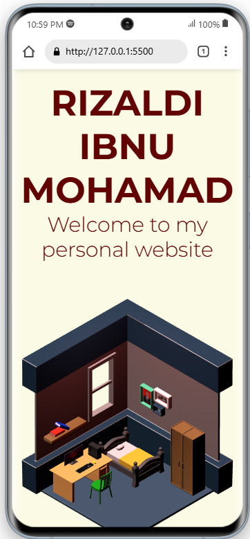

# Personal Portfolio Website

## 📄 Overview

This is a **personal portfolio website** showcasing my background and projects, serving as an online profile.

## ✨ Features Implemented

- **Navigation:** Navigate through the web.

- **About Me section:** Brief introduction including education, work experience, and interests.
- **Project showcase:**
  - Displays various projects with screenshots, descriptions, and technology stacks.
  - External links to playable games (_Itch.io_) and live 3D portfolio site (_Vercel_).
- **Contact form:**
  - Basic form validation (`required` fields).
  - Collects name, email, and message for inquiries (backend email handling pending or using form services).

## 🔧 Technologies Used

- **HTML5** — page structure and semantic markup.
- **CSS** — responsive styling and readability.
- **Javascript** — responsive nav and manage 3d objects
- **Three Js** — render 3d objects
- **Tools & Platforms:**
  - [GitHub](https://github.com/) for version control and repository management.

## 🚀 Accessing the Deployed Page

Visit the deployed website at:  
➡️ **[https://revou-fsse-jun25.github.io/milestone-1-Rizaldi87/](https://revou-fsse-jun25.github.io/milestone-1-Rizaldi87/)**

### ✅ How to Use the Website

1. Use navigation menu at top to move between sections.
2. Browse the **Home** and **About Me** sections to learn about my background.
3. Explore the **Projects** section:
   Use the project links (if any) to try the games or view live demos.
4. Fill out the **Contact Me** form and submit your message. (For now its only static form it does not send any data)

---
